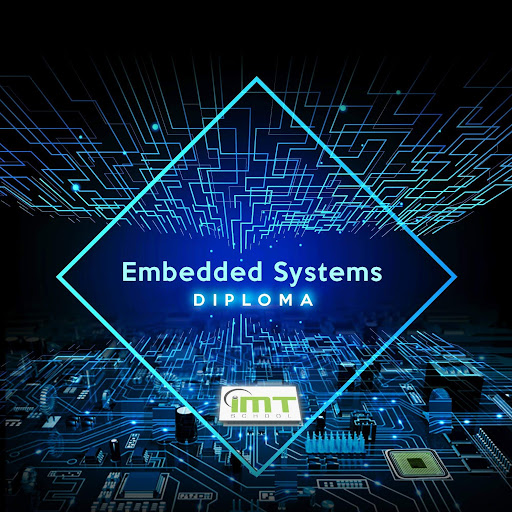

# ITI_Embedded_Systems_Training
This repo contains all the codes developed for the training  
Training contains :  
1 - C  
2 - Embedded systems concepts  
3 - AVR interfacing  
4 - Software Testing  
5 - Automotive Bus Technology  
6 - ES Tooling  
7 - Real Time Operating Systems  

  

___

# Additional recommended courses : 

1. [Data structure ](https://www.youtube.com/watch?v=cGgzFPRLl4o&list=PLoK2Lr1miEm-5zCzKE8siQezj9rvQlnca)
2. [GitHub ](https://www.youtube.com/playlist?list=PL4cUxeGkcC9goXbgTDQ0n_4TBzOO0ocPR)
3. [STM32 El deep ](https://www.youtube.com/watch?v=scjT2yVA5tg&list=PLPFp2zIiTnxXjxS-tC0u6m5zuSSJ1NLFw)
4. [Baremetal ](https://www.youtube.com/watch?v=qWqlkCLmZoE&list=PLERTijJOmYrDiiWd10iRHY0VRHdJwUH4g) : Startup code, linker script, Make file  

___

# Additional recommended Books : 

1. Reusable Firmware Development: A Practical Approach to APIs, HALs and Drivers.
2. Design Patterns for Embedded Systems in C.
3. Patterns for Time‑triggered Embedded Systems.

 

